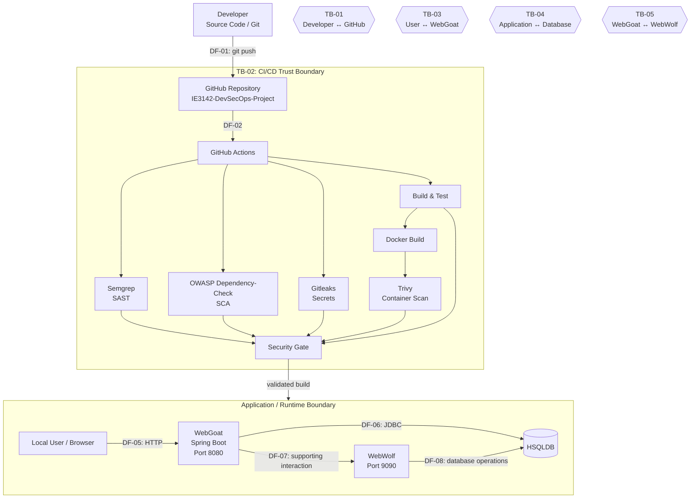

# IE3142 DevSecOps Project — Architecture Diagram Specification

Use this Mermaid diagram in the technical report or convert it to a rendered image.

## Diagram legend

- **TB-01:** source-code/repository trust boundary.
- **TB-02:** automated CI/CD processing boundary.
- **TB-03:** main external application attack surface.
- **TB-04:** application-to-database boundary.
- **TB-05:** component-to-component application boundary.

## Vulnerability placement

| Vulnerability | Diagram location |
|---|---|
| V01 Missing Function Level Access Control | TB-03: User → WebGoat authorization |
| V02 SQL Injection | TB-04: WebGoat → HSQLDB |
| V03 XSS | TB-03: User input → WebGoat rendering |
| V04 Insecure Deserialization | WebGoat application deserialization boundary |

> Note: The exact V04 STRIDE classification must be justified from the demonstrated data flow and impact, as required by the group work plan.
